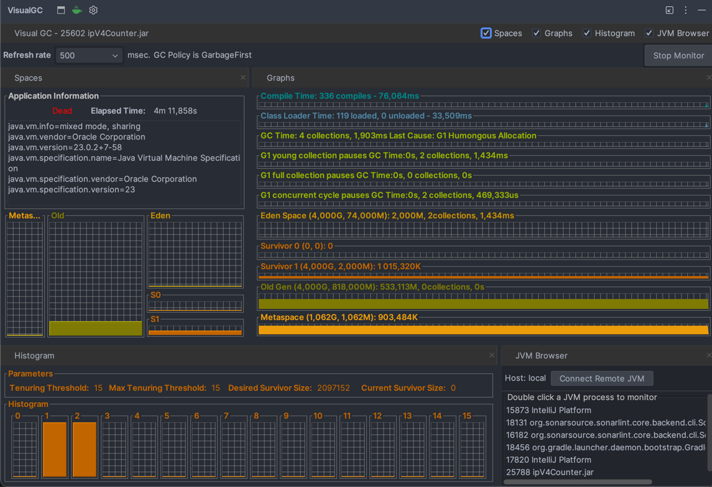

# IPv4 Unique Address Counter

This project is a high-performance Java application that efficiently counts **unique IPv4 addresses** from extremely large text files (e.g., 20–120 GB uncompressed). It is optimized for speed and minimal memory usage, using only the Java Standard Library (Java 21+).

## 💡 Problem Statement

Given a text file containing one IPv4 address per line, your task is to calculate how many **unique** addresses are present.

A naive solution might store each line as a `String` in a `HashSet`, which:
- Consumes **too much memory**
- Is **slow** on large files due to object creation and GC overhead

This implementation avoids those pitfalls by working directly with bytes and compact data structures.

## 🚀 Solution Overview

- **Zero String allocations**: Parses IPs directly from raw bytes
- **Custom IPv4 parser**: Converts "192.168.0.1" into a 32-bit integer
- **Bit-level uniqueness tracking**:
    - A single `long[]` array (~512MB) covers the entire IPv4 space (2³² addresses)
- **Efficient I/O**: Buffered read with 16MB chunks
- **No external libraries**: 100% Java Standard Library

## 📂 Input Format

Each line of the input file contains one valid IPv4 address:
145.67.23.4 8.34.5.23 89.54.3.124 89.54.3.124 3.45.71.5 ...

File size may be hundreds of gigabytes.

## 🛠️ How to Build and Run

### ✅ Requirements
- Java 21 or later

### 🧪 Compile

```bash
javac -d out src/com/example/ip4counter/*.java
```
HERE IS EXAMPLE OF MEMORY ANALYZE
